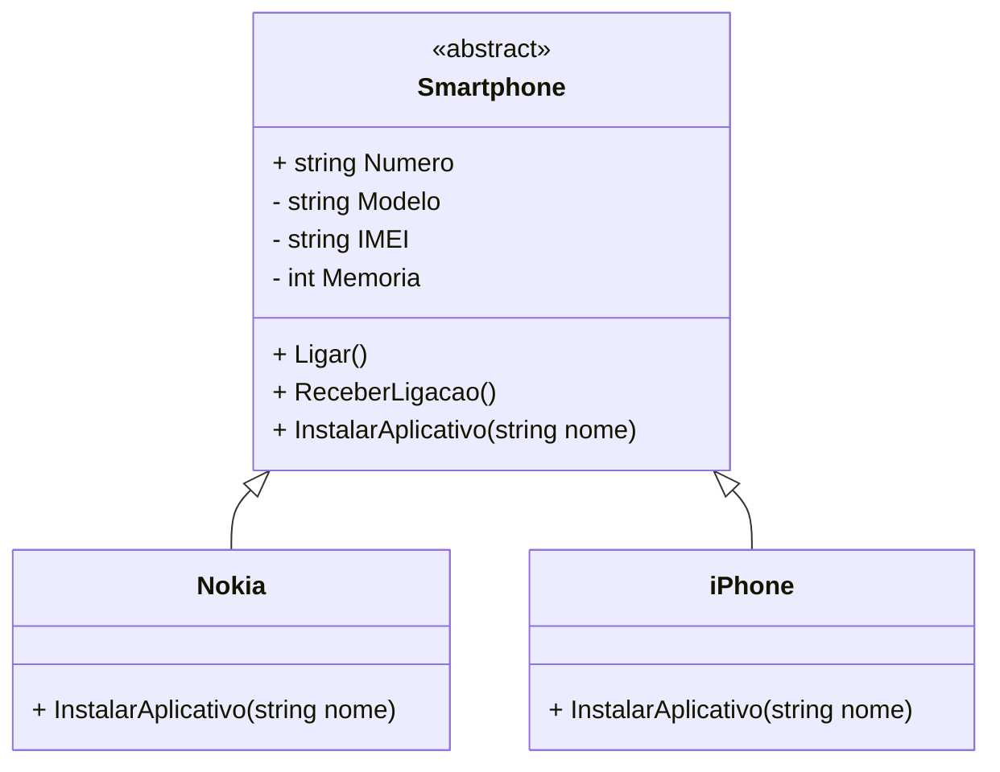

# DIO Desafio - Modelando um Smartphone usando POO com .NET e C#

## Autor
- [Felipe Figueiredo Bezerra](https://github.com/FigFelipe)

## Desafio do Projeto

Para este desafio, você precisará usar seus conhecimentos adquiridos no módulo de orientação a objetos, da trilha .NET da DIO.

> **Nota:** As **Instruções** de desenvolvimento foram seguidas diretamente do [repositório DIO - Trilha NET POO Básico.]([https://github.com/digitalinnovationone/trilha-java-basico/tree/main/desafios/poo](https://github.com/digitalinnovationone/trilha-net-poo-desafio))

## Contexto

Você é responsável por modelar um sistema que trabalha com celulares. Para isso, foi solicitado que você faça uma abstração de um celular e disponibilize maneiras de diferentes marcas e modelos terem seu próprio comportamento, possibilitando um maior reuso de código e usando a orientação a objetos.

## Ambiente de Desenvolvimento

 - **IDE**: Visual Studio 22 (Community Edition)
 - **SDK:** .NET 8.0

## Modelamento UML sugerida

## Regras e Validações

1. A classe Smartphone deve ser abstrata, não permitindo instanciar e servindo apenas como modelo.
2. A classe Nokia e Iphone devem ser classes filhas de Smartphone.
3. O método InstalarAplicativo deve ser sobrescrito na classe Nokia e iPhone, pois ambos possuem diferentes maneiras de instalar um aplicativo.

## Solução
O código está pela metade, e você deverá dar continuidade obedecendo as regras descritas acima, para que no final, tenhamos um programa funcional. Procure pela palavra comentada "TODO" no código, em seguida, implemente conforme as regras acima.
